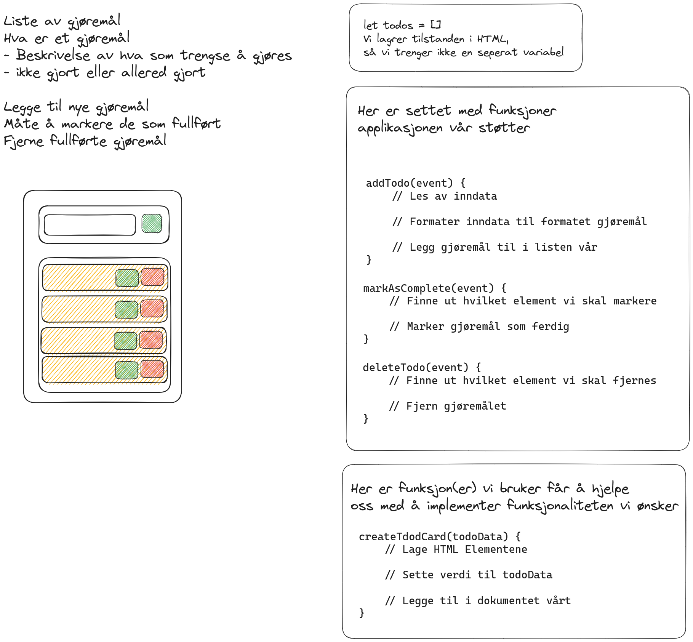

# Todo App

Et eksempel for hvordan en Todo applikasjon kan bli brutt ned til mindre biter.
Her har vi stykket det opp i en tilstand som må taes vare på, og et sett med funksjoner for å støtte opp rundt funksjonalitet vi har i designet vårt.

## Breakdown



## Shopping list

Her er en liste over forskjellige metoder (funksjoner) som du kan bruke, listen er ikke uttømmende og det finnes alternative løsninger å løse de forskjellige problemene.
Listen er gruppert etter det vi fant ut i designet vårt, vi trenger av funksjonalitet.

### DOM Manipulation:
- En måte å finne elementer på
  - [document.getElementById()](https://developer.mozilla.org/en-US/docs/Web/API/Document/getElementById)
  - [document.querySelectorAll()](https://developer.mozilla.org/en-US/docs/Web/API/Document/querySelector)

- Lage nye elementer
  - [document.createElement()](https://developer.mozilla.org/en-US/docs/Web/API/Document/createElement)
    
- Legge til elementer til DOM
  - [element.appendChild()](https://developer.mozilla.org/en-US/docs/Web/API/Node/appendChild)

- Fjerne elementer fra DOM
  - [element.remove()](https://developer.mozilla.org/en-US/docs/Web/API/Element/remove)

- Endre og Lese av verdier
  - [`element.textContent = nyVerdi`](https://developer.mozilla.org/en-US/docs/Web/API/Node/textContent)
  - `let value = element.value`
  - [`element.className = nyeKlasser`](https://developer.mozilla.org/en-US/docs/Web/API/Element/className)
  - let value = element.className
  - [element.className.toggle()](https://developer.mozilla.org/en-US/docs/Web/API/DOMTokenList/toggle)

### Event Listners and Event Handlers

- [MDN Oversikt - Event Handling](https://developer.mozilla.org/en-US/docs/Web/Events/Event_handlers)

- Lytte etter hendelser (event listners)
  - [element.addEventListner("click", eventHandler)](https://developer.mozilla.org/en-US/docs/Web/API/EventTarget/addEventListener)
  ```js
  // Først finn elementet du ønsker å legge til en hendelses lytter til
  const element = document.getElementById("button")

  // Legg til en lytter (funksjon) til elementet

  // Det er i hovedsak to metoder som blir brukt for å gjøre dette
  // Spesifiser hvilken hendelse du ønsker å lytte etter og gi en funksjon som skal kjøre.
  // Funksjonen er definert et annet sted
  element.addEventListner("click", addTodo)

  // Definer funksjonen i "innline" (inne i parantesene). Dette gjøres ved hjelp av noe som kalles
  // lamda funskjoner / arrow functions.
  element.addEventListner("click", (event) => {
    // Legg logikken inni her. Er samme logikken her som du ville ha definert et annet sted
  })
  ```

- Håndterer hendelser (event handlers)
  -
  ```js
  // Definer blokken med kode som du ønsker skal kjøre når hendelsen intreffer
  // Dette blir gjort ved hjelp av en funksjon som tar imot hendelsen som en parameter
  // Gi den et navn som forteller hva som skal skje,
  // se design dokumentet som er lagd for hva funksjonalitet denne skal stå for
  function addTodo(event) {
        // Her inni er logikken som skal kjøre når en hendelse intreffer

        // Event parameteren som taes inn er et JavaScript objekt som inneholder
        // informasjon om hendelsen
        // Log det ut til konsollen for å se hva det inneholder,
        // hvilken informasjon du har tilgang på er mye informasjon
        console.log(event)


        // Noe du kommer til å bruke er det elementet som satt i gang hendelsen
        // Du kan få tak i det ved å gå inn i "target" feltet på hendelsen
        const triggerElement = event.target
        console.log(triggerElement)
    }
  ```